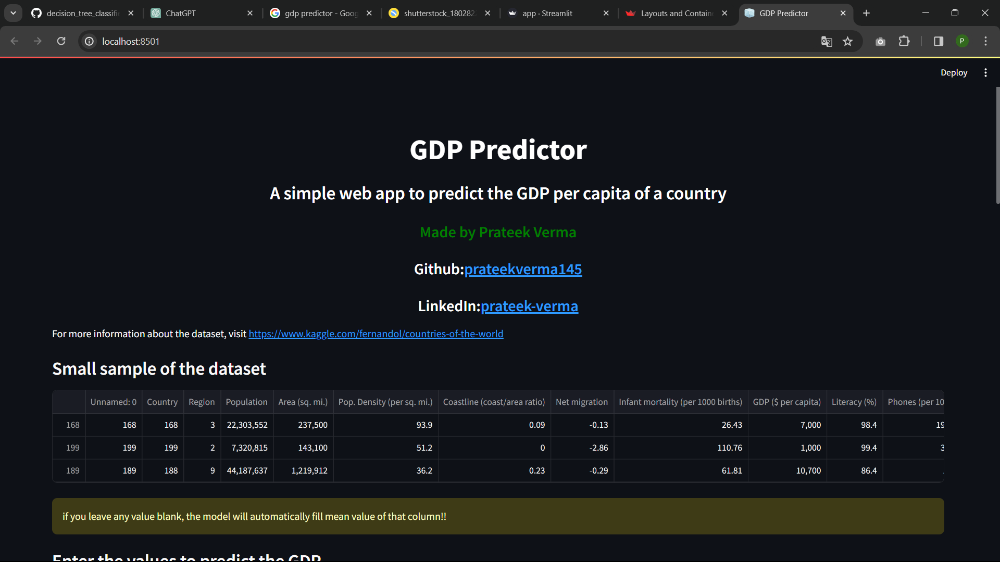
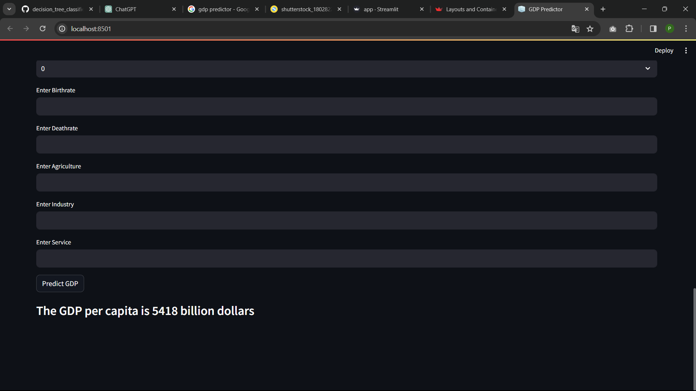

GDP Predictor is an innovative machine learning project designed to forecast the Gross Domestic Product (GDP) of countries based on a set of economic indicators. By leveraging advanced machine learning algorithms and data analysis techniques, this predictor aims to contribute valuable insights into economic trends and help stakeholders make informed decisions.

## Key Features
Predictive Modeling: The project utilizes state-of-the-art machine learning models to analyze historical economic data and predict future GDP values.

Scalability: Built with scalability in mind, the GDP Predictor is capable of handling diverse datasets from various countries, allowing for broad applicability.

User-Friendly Interface: The project provides a simple and user-friendly interface for users to input economic indicators and obtain GDP predictions effortlessly.

Interpretability: Emphasis is placed on model interpretability, enabling users to understand the factors influencing GDP predictions and fostering transparency in decision-making.

## How It Works
Data Collection: The project relies on a comprehensive dataset of economic indicators such as inflation rates, unemployment figures, and trade balances, sourced from reliable repositories.

Data Preprocessing: Prior to model training, the data undergoes preprocessing to handle missing values, normalize features, and ensure that it meets the quality standards required for accurate predictions.

Model Training: The machine learning model is trained using historical economic data, learning the complex relationships between various indicators and GDP values.

Prediction: Once trained, the model can predict GDP values for a given set of economic indicators, offering a forward-looking perspective on a country's economic performance.
# Algorithm used: RandomForestRegressor
to learn more about randomforestreggressor :([URL "Tooltip Text"](https://scikit-learn.org/stable/modules/generated/sklearn.ensemble.RandomForestRegressor.html))
## Screenshots

## To run streamlit app write : streamlit run <filename>
